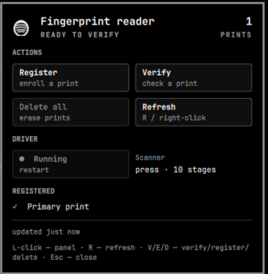

# Fingerprint — Omarchy bar widget

Omarchy bar-widget to monitor and control the **FPC 9201 fingerprint reader**
on Redmi Book 16 / compatible laptops, driven by the [fingerprint-ocv
daemon](https://github.com/zimixin/fingerprint-ocv).

## Features

- Bar icon: colorized fingerprint glyph + enrolled count.
  - color: `urgent` = no print / driver down, `foreground` = ready.
- Popup panel:
  - **Actions** — Register / Verify / Delete-all / Refresh (V/E/D/R hotkeys).
  - **Driver** — start / restart the `fingerprint-ocv` user service from the panel.
  - **Registered list** — names of stored prints, each with a **✎ rename** button
    (renames the stored template via D-Bus — no re-scan needed).
- Actions launch in a floating terminal with **live progress** (enroll shows
  `Stage X/10 [██░░…] presses: N`, one carriage-return line).
- **Verify reports which finger matched** (`Match found: primary`) — the
  driver's `verify-match` signal now carries the matched print name.

## Screenshot



## Requirements

- The **fingerprint-ocv** D-Bus daemon must be running (see
  [zimixin/fingerprint-ocv](https://github.com/zimixin/fingerprint-ocv)) and
  own the session bus name `net.reactivated.Fprint`.
- User is `/home/<user>`; the widget talks to the driver over the D-Bus
  session bus and to `systemd --user` for the service control.

## Install

```bash
omarchy plugin add https://github.com/zimixin/omarchy-fingerprint
```

Then add it to the bar: edit `~/.config/omarchy/shell.json` →
`bar.layout.right` → append `{"id":"zimixin.fingerprint"}`, then
`omarchy-restart-shell`.

## Files

- `Panel.qml` — bar button + popup (Quickshell, `qs.Ui` components).
- `bin/fp-status.sh` — status collector; writes
  `~/.local/state/omarchy/fingerprint/status.json` (keeps last-known on error).
- `bin/fp-pam-verify` — pam_exec gate for **fingerprint unlock**: verifies
  directly against the session-bus driver, exit 0 on match; `--list` prints
  enrolled prints (used to fake the `fprintd-list` gate in the lock screen).
- `bin/fprintd-list` — wrapper that shadows `/usr/bin/fprintd-list` so the
  lock screen detects the real session driver instead of system fprintd.
- `pam/omarchy-lock-fingerprint` — reference PAM stack for the lock screen.

## Fingerprint unlock (lock screen)

The Omarchy lock screen has built-in fingerprint support
(`Quickshell.Services.Pam`), but its stock path goes through system-bus
`fprintd`, which cannot see this driver (it has no FPC 9201 driver and
auto-activates a broken daemon → "No devices available"). Instead the unlock
gate talks to the session driver directly:

1. Install the bridge somewhere stable:
   `sudo install -m 0755 bin/fp-pam-verify /usr/local/bin/fp-pam-verify`
2. Shadow the lock screen's fingerprint gate so it detects the real driver
   (must be earlier in PATH than `/usr/bin/fprintd-list`):
   `sudo install -m 0755 bin/fprintd-list /usr/local/bin/fprintd-list`
3. Install the PAM stack:
   `sudo install -m 0644 pam/omarchy-lock-fingerprint /etc/pam.d/omarchy-lock-fingerprint`
   — if you installed the bridge somewhere other than `/usr/local/bin`,
   edit the path inside `fp-pam-verify`'s PAM line.

The lock screen forks the PAM subprocess WITHOUT `setuid`, so the gate runs as
the session user and reaches the session bus. **sudo / polkit unlock is not
supported**: there the gate runs as root, which has no session-bus access.

## Notes

- **No background polling.** The fingerprint-ocv daemon is not concurrency-safe
  on D-Bus (can abort on parallel calls). Status is refreshed only when the
  panel opens / the user clicks a refresh.
- `finger-present` is not shown as "touching now" — the driver's property
  latches `true` after the first touch of a scan.

## License

MIT — see `LICENSE`.